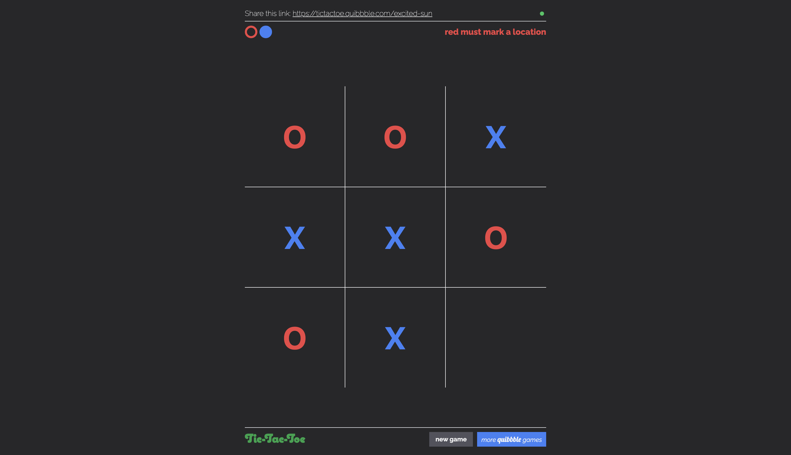

# TicTacToe

[](https://app.netlify.com/sites/tictactoe-quibbble/deploys)

TicTacToe game website. Play at [tictactoe.quibbble.com](https://tictactoe.quibbble.com).

This repo contains [ReactJS](https://react.dev) frontend code and makes use of custom React components found at [boardgame](https://github.com/quibbble/boardgame). Game logic can be found at [go-tictactoe](https://github.com/quibbble/go-boardgame/examples/tictactoe). Server logic can be found at [go-quibbble](https://github.com/quibbble/go-quibbble). 

[](https://tictactoe.quibbble.com)

## Run Locally

- Generate a personal `GITHUB_ACCESS_TOKEN` with package read permissions. Read more about it [here](https://docs.github.com/en/packages/working-with-a-github-packages-registry/working-with-the-npm-registry).
- Create a `.npmrc` file in the `tictactoe` root directory with the following:
```
//npm.pkg.github.com/:_authToken=<GITHUB_ACCESS_TOKEN>
@quibbble:boardgame=https://npm.pkg.github.com
```
- Run `npm i`.
- Run the quibbble server ([go-quibbble](https://github.com/quibbble/go-quibbble)) locally on port `8080`.
- Create a `.env.local` file in the `tictactoe` root directory with the following:
```
VITE_HOST="http://127.0.0.1:8080"
VITE_WEBSOCKET="ws://127.0.0.1:8080"
```
- Run `npm start`.
